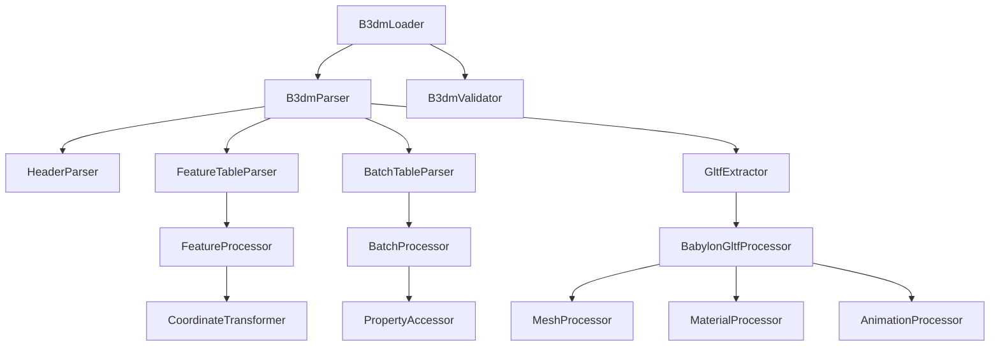

# B3DM Loader Implementation Design

## Overview

The B3DM Loader implementation will provide comprehensive support for parsing and rendering Batched 3D Model (B3DM) tiles within our modular 3D Tiles architecture. The design follows the existing patterns established in our refactored codebase while introducing specialized components for B3DM format handling, feature processing, and Babylon.js integration.

## Architecture

### High-Level Architecture



### Component Relationships

The B3DM loader integrates with our existing modular architecture:

```
src/loaders/b3dm/
├── B3dmLoader.js              # Main loader class (extends BaseLoader)
├── parser/
│   ├── B3dmParser.js          # Core B3DM parsing logic
│   ├── HeaderParser.js        # Binary header parsing
│   ├── FeatureTableParser.js  # Feature table processing
│   ├── BatchTableParser.js    # Batch table processing
│   └── GltfExtractor.js       # GLTF data extraction
├── processors/
│   ├── FeatureProcessor.js    # Feature data processing
│   ├── BatchProcessor.js      # Batch data processing
│   ├── MeshProcessor.js       # Mesh processing for Babylon.js
│   ├── MaterialProcessor.js   # Material processing
│   └── AnimationProcessor.js  # Animation processing
├── validation/
│   ├── B3dmValidator.js       # Format validation
│   ├── HeaderValidator.js     # Header validation
│   └── TableValidator.js      # Table validation
└── utils/
    ├── BinaryReader.js        # Binary data reading utilities
    ├── TypedArrayUtils.js     # Typed array processing
    └── B3dmConstants.js       # Format constants and enums
```

## Components and Interfaces

### 1. B3dmLoader (Main Interface)

```javascript
export class B3dmLoader extends BaseLoader {
    constructor(options = {}) {
        super(options);
        this.parser = new B3dmParser(options);
        this.validator = new B3dmValidator();
        this.processor = new B3dmProcessor(options);
    }

    supports(path) {
        return path.toLowerCase().includes('.b3dm');
    }

    async load(request) {
        // Main loading pipeline
        const arrayBuffer = await this.fetchData(request);
        const b3dmData = await this.parser.parse(arrayBuffer);
        const processedData = await this.processor.process(b3dmData, request);
        return processedData;
    }
}
```

### 2. B3dmParser (Core Parsing Logic)

```javascript
export class B3dmParser {
    constructor(options = {}) {
        this.headerParser = new HeaderParser();
        this.featureTableParser = new FeatureTableParser();
        this.batchTableParser = new BatchTableParser();
        this.gltfExtractor = new GltfExtractor();
        this.validator = new B3dmValidator();
    }

    async parse(arrayBuffer) {
        // Parse B3DM structure
        const header = this.headerParser.parse(arrayBuffer);
        this.validator.validateHeader(header);
        
        const featureTable = this.featureTableParser.parse(arrayBuffer, header);
        const batchTable = this.batchTableParser.parse(arrayBuffer, header);
        const gltfData = this.gltfExtractor.extract(arrayBuffer, header);
        
        return {
            header,
            featureTable,
            batchTable,
            gltfData
        };
    }
}
```

### 3. HeaderParser (Binary Header Processing)

```javascript
export class HeaderParser {
    parse(arrayBuffer) {
        const dataView = new DataView(arrayBuffer);
        let byteOffset = 0;
        
        // Parse B3DM header structure
        const header = {
            magic: this.readString(dataView, byteOffset, 4),
            version: dataView.getUint32(byteOffset + 4, true),
            byteLength: dataView.getUint32(byteOffset + 8, true),
            featureTableJSONByteLength: dataView.getUint32(byteOffset + 12, true),
            featureTableBinaryByteLength: dataView.getUint32(byteOffset + 16, true),
            batchTableJSONByteLength: dataView.getUint32(byteOffset + 20, true),
            batchTableBinaryByteLength: dataView.getUint32(byteOffset + 24, true)
        };
        
        return header;
    }
}
```

### 4. FeatureTableParser (Feature Data Processing)

```javascript
export class FeatureTableParser {
    parse(arrayBuffer, header) {
        const jsonByteLength = header.featureTableJSONByteLength;
        const binaryByteLength = header.featureTableBinaryByteLength;
        
        if (jsonByteLength === 0) return null;
        
        const jsonData = this.parseJSON(arrayBuffer, B3DM_HEADER_BYTE_LENGTH, jsonByteLength);
        const binaryData = binaryByteLength > 0 ? 
            this.parseBinary(arrayBuffer, B3DM_HEADER_BYTE_LENGTH + jsonByteLength, binaryByteLength) : 
            null;
            
        return new FeatureTable(jsonData, binaryData);
    }
}
```

### 5. BatchTableParser (Batch Data Processing)

```javascript
export class BatchTableParser {
    parse(arrayBuffer, header) {
        const featureTableTotalLength = header.featureTableJSONByteLength + header.featureTableBinaryByteLength;
        const jsonByteLength = header.batchTableJSONByteLength;
        const binaryByteLength = header.batchTableBinaryByteLength;
        
        if (jsonByteLength === 0) return null;
        
        const jsonOffset = B3DM_HEADER_BYTE_LENGTH + featureTableTotalLength;
        const jsonData = this.parseJSON(arrayBuffer, jsonOffset, jsonByteLength);
        
        const binaryData = binaryByteLength > 0 ?
            this.parseBinary(arrayBuffer, jsonOffset + jsonByteLength, binaryByteLength) :
            null;
            
        return new BatchTable(jsonData, binaryData);
    }
}
```

### 6. GltfExtractor (GLTF Data Extraction)

```javascript
export class GltfExtractor {
    extract(arrayBuffer, header) {
        const gltfOffset = this.calculateGltfOffset(header);
        const gltfByteLength = header.byteLength - gltfOffset;
        
        if (gltfByteLength <= 0) {
            throw new Error('No GLTF data found in B3DM');
        }
        
        const gltfBuffer = arrayBuffer.slice(gltfOffset, gltfOffset + gltfByteLength);
        return this.processGltfData(gltfBuffer);
    }
    
    calculateGltfOffset(header) {
        return B3DM_HEADER_BYTE_LENGTH +
               header.featureTableJSONByteLength +
               header.featureTableBinaryByteLength +
               header.batchTableJSONByteLength +
               header.batchTableBinaryByteLength;
    }
}
```

## Data Models

### B3DM Header Structure

```javascript
class B3dmHeader {
    constructor() {
        this.magic = '';           // 4 bytes - "b3dm"
        this.version = 0;          // 4 bytes - Version number
        this.byteLength = 0;       // 4 bytes - Total byte length
        this.featureTableJSONByteLength = 0;   // 4 bytes
        this.featureTableBinaryByteLength = 0; // 4 bytes
        this.batchTableJSONByteLength = 0;     // 4 bytes
        this.batchTableBinaryByteLength = 0;   // 4 bytes
    }
}
```

### Feature Table Structure

```javascript
class FeatureTable {
    constructor(jsonData, binaryData) {
        this.json = jsonData;
        this.binary = binaryData;
        this.batchLength = jsonData.BATCH_LENGTH || 0;
        this.rtcCenter = jsonData.RTC_CENTER || null;
    }
    
    getBatchLength() {
        return this.batchLength;
    }
    
    getRtcCenter() {
        return this.rtcCenter;
    }
}
```

### Batch Table Structure

```javascript
class BatchTable {
    constructor(jsonData, binaryData) {
        this.json = jsonData;
        this.binary = binaryData;
        this.properties = this.parseProperties();
    }
    
    getProperty(batchId, propertyName) {
        const property = this.properties[propertyName];
        if (!property) return undefined;
        
        return property.getValue(batchId);
    }
    
    parseProperties() {
        const properties = {};
        for (const [name, definition] of Object.entries(this.json)) {
            properties[name] = new BatchProperty(name, definition, this.binary);
        }
        return properties;
    }
}
```

## Error Handling

### Error Types

```javascript
export class B3dmError extends Error {
    constructor(message, code, context = {}) {
        super(message);
        this.name = 'B3dmError';
        this.code = code;
        this.context = context;
    }
}

export const B3DM_ERROR_CODES = {
    INVALID_MAGIC: 'INVALID_MAGIC',
    UNSUPPORTED_VERSION: 'UNSUPPORTED_VERSION',
    INVALID_HEADER: 'INVALID_HEADER',
    FEATURE_TABLE_ERROR: 'FEATURE_TABLE_ERROR',
    BATCH_TABLE_ERROR: 'BATCH_TABLE_ERROR',
    GLTF_EXTRACTION_ERROR: 'GLTF_EXTRACTION_ERROR',
    PROCESSING_ERROR: 'PROCESSING_ERROR'
};
```

### Error Handling Strategy

```javascript
class B3dmErrorHandler {
    static handleParsingError(error, context) {
        if (error instanceof B3dmError) {
            console.error(`B3DM Error [${error.code}]:`, error.message, error.context);
        } else {
            console.error('Unexpected B3DM parsing error:', error);
        }
        
        // Provide recovery suggestions
        return this.createRecoveryPlan(error, context);
    }
    
    static createRecoveryPlan(error, context) {
        switch (error.code) {
            case B3DM_ERROR_CODES.INVALID_MAGIC:
                return { canRecover: false, suggestion: 'File is not a valid B3DM' };
            case B3DM_ERROR_CODES.FEATURE_TABLE_ERROR:
                return { canRecover: true, suggestion: 'Continue without feature table' };
            default:
                return { canRecover: false, suggestion: 'Unable to process B3DM file' };
        }
    }
}
```

## Testing Strategy

### Unit Testing Approach

1. **Header Parsing Tests**
   - Valid header parsing
   - Invalid magic number handling
   - Boundary condition testing
   - Endianness verification

2. **Feature Table Tests**
   - JSON parsing validation
   - Binary data interpretation
   - RTC_CENTER processing
   - BATCH_LENGTH validation

3. **Batch Table Tests**
   - Property access patterns
   - Typed array handling
   - Hierarchical data support
   - Performance benchmarks

4. **GLTF Integration Tests**
   - GLB format handling
   - External reference resolution
   - Babylon.js compatibility
   - Material processing

### Integration Testing

```javascript
describe('B3dmLoader Integration', () => {
    test('should load real-world B3DM files', async () => {
        const loader = new B3dmLoader({
            scene: mockScene,
            renderer: mockRenderer
        });
        
        const result = await loader.load({
            path: 'test-data/sample.b3dm',
            abortController: new AbortController()
        });
        
        expect(result).toBeInstanceOf(BABYLON.AssetContainer);
        expect(result.meshes.length).toBeGreaterThan(0);
    });
});
```

### Performance Testing

```javascript
class B3dmPerformanceProfiler {
    static async profileLoading(b3dmFile) {
        const startTime = performance.now();
        
        const metrics = {
            headerParsing: 0,
            featureTableParsing: 0,
            batchTableParsing: 0,
            gltfExtraction: 0,
            babylonProcessing: 0,
            totalTime: 0
        };
        
        // Profile each stage
        const result = await this.profiledLoad(b3dmFile, metrics);
        
        metrics.totalTime = performance.now() - startTime;
        return { result, metrics };
    }
}
```

## Configuration and Extensibility

### Configuration Options

```javascript
const B3DM_DEFAULT_CONFIG = {
    // Parsing options
    validateHeader: true,
    strictMode: false,
    maxFileSize: 100 * 1024 * 1024, // 100MB
    
    // Processing options
    applyRtcCenter: true,
    processAnimations: true,
    optimizeMaterials: true,
    
    // Performance options
    useWorkers: false,
    chunkSize: 1024 * 1024, // 1MB chunks
    concurrentLimit: 4,
    
    // Babylon.js integration
    createAssetContainer: true,
    freezeMaterials: true,
    optimizeVertices: false,
    
    // Debugging
    enableProfiling: false,
    logLevel: 'warn'
};
```

### Extension Points

```javascript
export class B3dmLoaderExtensions {
    static registerFeatureProcessor(name, processor) {
        // Allow custom feature processing
    }
    
    static registerBatchProcessor(name, processor) {
        // Allow custom batch processing
    }
    
    static registerValidator(name, validator) {
        // Allow custom validation rules
    }
}
```

This design provides a comprehensive, modular, and extensible foundation for B3DM support while integrating seamlessly with our existing 3D Tiles architecture.